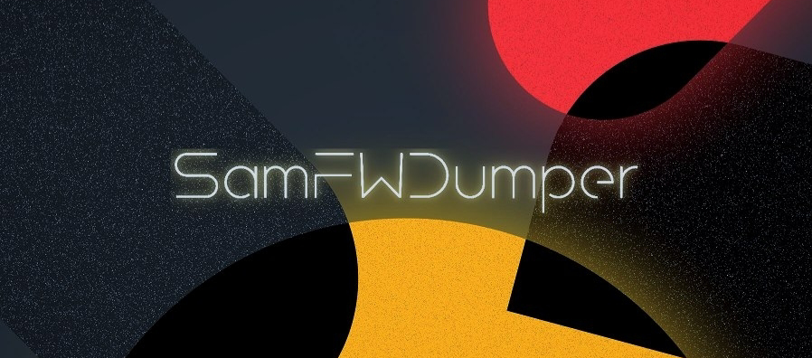

# SamFWDumper

A free tool that downloads Samsung firmware and pulls out the parts you need. No software to install, it all runs in your browser through GitHub Actions.

## What This Actually Means

You know those big firmware files from SamFW? This tool:
- Downloads that file for you
- Opens it up
- Grabs only what you asked for
- Gives you a download link

You don't need a powerful computer. You don't need to install anything. GitHub's servers do all the work.

---

## Before You Start

- Click the **Fork** button at the top right of this page and click fork to ur git account
- Go to the **Actions** tab on your fork. If workflows are disabled, click **"I understand my workflows"**

Done. You only do this once.

---

## How to Get a Firmware Link

Before using this tool, you need a direct download link from SamFW. Here's how:

1. Go to [samfw.com](https://samfw.com) and search for your device, you can type the model number (e.g., `SM-S918B`) or the device name (e.g., `S23 Ultra`), then pick your region/CSC (e.g., `EUX`)

2. Choose the firmware version, then click the red button **"Download SamFW Server"**

3. Wait a moment, a **"Download"** button will appear. Click it, then **cancel the download immediately**

4. Now right-click the same **"Download"** button again (or long-press if you're on Android) and select **"Copy link address"**

That link is what you'll paste into the workflow.

---

## Two Ways to Use It

| | **Images Extractor** | **System Files Extractor** |
|---|---|---|
| **Gets you** | Raw partition images | Files & folders from firmware |
| **Use when** | Flash, inspect, or mod an image | Grab apps, configs, files from system |

**Steps (same for both):**
- Go to **Actions** → pick your workflow above
- Paste your SamFW link
- Pick compression 0~9 (0 = fast but big file, 9 = slow but small file)
- Choose upload destination (GoFile or GitHub Releases)
- Tick what you want (see below)
- Hit **Run workflow**. Wait a few minutes. Download link appears.

---

**Images Extractor** - which partitions can you grab?

`boot` `dtbo` `init_boot` `odm` `odm_dlkm` `product` `recovery` `system` `system_dlkm` `system_ext` `vbmeta` `vbmeta_system` `vendor` `vendor_boot` `vendor_dlkm`

---

**System Files Extractor** - which files and folders can you pull?

| | What's inside |
|---|---|
| `app` | Preinstalled apps (APKs) |
| `bin` | System binaries |
| `cameradata` | Camera tuning files |
| `etc` | Configs and permissions |
| `lib` | 32-bit libraries |
| `lib64` | 64-bit libraries |
| `media` | Sounds, fonts, boot animation |
| `priv-app` | Privileged system apps |
| `saiv` | Samsung AI Vision stuff |
| `config` | XML configs |
| `super config` | Super image metadata (for repacking) |
| `build.prop` | Device info and fingerprint |
| `framework-res RRO` | Overlay APK from product partition |
| `PIT file` | Partition table from CSC |
| `wallpaper-res.apk` | Wallpaper APK from priv-app |

## What's Happening Behind the Scenes

1. Downloads the firmware zip
2. Unzips it, finds the AP tar (and CSC when extracting PIT)
3. Checks for dynamic partitions and unpacks super.img if found
4. Grabs exactly what you selected, nothing extra
5. Packages everything as `.xz` or `.tar.xz`
6. Uploads to **GitHub Releases** or **GoFile** and gives you a link

Works on both legacy and modern Samsung devices. If the device uses A/B slots, partition names are kept untouched (`_a` and `_b`).

## License

This project is licensed under the [PolyForm Noncommercial License 1.0.0](LICENSE) - personal and non-commercial use only.

**Distribution Restriction:** Redistribution of this software, modified or unmodified, is ONLY permitted via GitHub's official fork mechanism from this repository. Direct copying, re-uploading, or creating standalone repositories of this code is prohibited.

See the [LICENSE](LICENSE) file for the full terms.
For commercial licensing inquiries, contact the repository owner via GitHub.

## Tools Used

This project relies on several open-source tools:

- [nmeum/android-tools](https://github.com/nmeum/android-tools) (Apache-2.0) - simg2img, img2simg, ext2simg, append2simg
- [LonelyFool/lpunpack_and_lpmake](https://github.com/LonelyFool/lpunpack_and_lpmake) (Apache-2.0) - lpunpack, lpdump, lpmake
- [sekaiacg/erofs-utils](https://github.com/sekaiacg/erofs-utils) (GPL-2.0/Apache-2.0) - EROFS filesystem tools
- [AOSP platform/external/avb](https://android.googlesource.com/platform/external/avb) (Apache-2.0) - avbtool
- [AOSP platform/external/e2fsprogs](https://android.googlesource.com/platform/external/e2fsprogs) (Apache-2.0) - e2fsdroid, mke2fs.android
- [AOSP platform/external/f2fs-tools](https://android.googlesource.com/platform/external/f2fs-tools) (Apache-2.0) - make_f2fs, sload_f2fs
- [AOSP platform/system/tools/mkbootimg](https://android.googlesource.com/platform/system/tools/mkbootimg) (Apache-2.0) - mkbootimg, unpack_bootimg, repack_bootimg
- [AOSP platform/system/libufdt](https://android.googlesource.com/platform/system/libufdt) (Apache-2.0) - mkdtboimg
- [tytso/e2fsprogs](https://github.com/tytso/e2fsprogs) (GPL-2.0/LGPL-2.1) - debugfs
- [tukaani/xz](https://github.com/tukaani-project/xz) (LGPL-2.1/GPL-2.0) - xz compression
- [lz4](https://github.com/lz4/lz4) (BSD-2-Clause) - LZ4 compression

Upload integration via [GoFile API](https://gofile.io/api).

## Credits

 
The platform that makes firmware accessible to everyone. The backbone this project stands on.

---

<table>
<tr>
<td colspan="3" align="center">
 
<a href="https://github.com/ravindu644" target="_blank">
 
<b>Ravindu Deshan</b>
</a> 
Senior Developer - For regularly reviewing the entire repository structure, ensuring everything is solid, and bringing seasoned expertise that keeps this project on the right track.
</td>
</tr>
<tr>
<td align="center" width="200">
<a href="https://github.com/DevCat3" target="_blank">
 
<b>DevCatowa</b>
</a> 
For helping in writing scripts that shaped the soul of this repo. an inspiring catowa. 
</td>
<td align="center" width="200">
<a href="https://github.com/QOS3" target="_blank">
 
<b>QOS3</b>
</a> 
For being our كطري 
</td>
<td align="center" width="200">
<a href="https://github.com/mrx7014" target="_blank">
 
<b>MRX7014</b>
</a> 
For the extraordinary commitment of being alive. Truly, it's enough we see you. 
</td>
</tr>
</table>

---

Copyright © 2026 Xiatsuma
